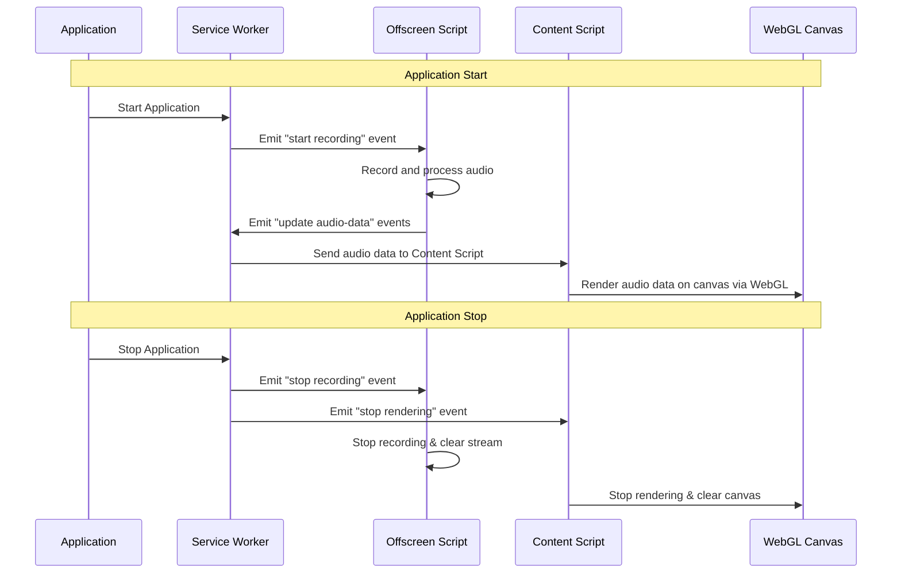

# Chrome audio visualizer extension

## Aplication flor over view
Application Lifecycle Overview
When the application is initiated, a series of interconnected events and processes are set into motion to facilitate audio recording and visualization within a web environment.

### Starting the Application:
* Initialization: The service worker springs into action, emitting an event to kick-start audio recording directly from the user's tab.
* Audio Capture and Processing: This signal is picked up by the offscreen script, which then proceeds to record and process the audio. Throughout this phase, the offscreen script is also responsible for emitting continuous updates about the audio data, ensuring a seamless flow of information.
* Visualization: The service worker, acting as a conduit, relays the processed audio data to the content script. Upon receipt, the content script employs WebGL to render this data onto a canvas, translating the audio signals into a visual representation that can be easily interpreted by the user.
* Active Listening: Concurrently, the content script remains vigilant for a 'stop' event, ready to halt the audio recording and visualization processes upon command.

### Stopping the Application:
* Cease Operations: As the application winds down, the service worker broadcasts two pivotal events—one to cease and clear the audio recording and another to stop the rendering and clear the canvas.
* Cleanup: The offscreen script responds by terminating the audio recording and purging any residual stream data, ensuring no traces are left behind. Similarly, the content script ceases its rendering operations and clears the canvas, resetting the visual workspace.```mermaid




## Running this extension
1. Clone this repository.
2. Load this directory in Chrome as an [unpacked extension](https://developer.chrome.com/docs/extensions/mv3/getstarted/development-basics/#load-unpacked).
3. Pin the extension from the extension menu.
4. Click the extension's action icon to start animation.
5. Click the extension's action again to stop animation.
